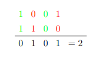
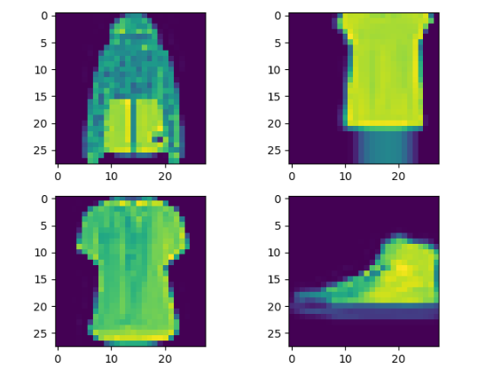
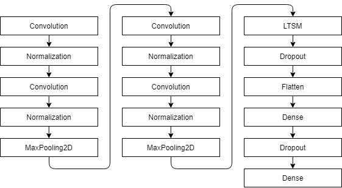
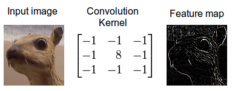
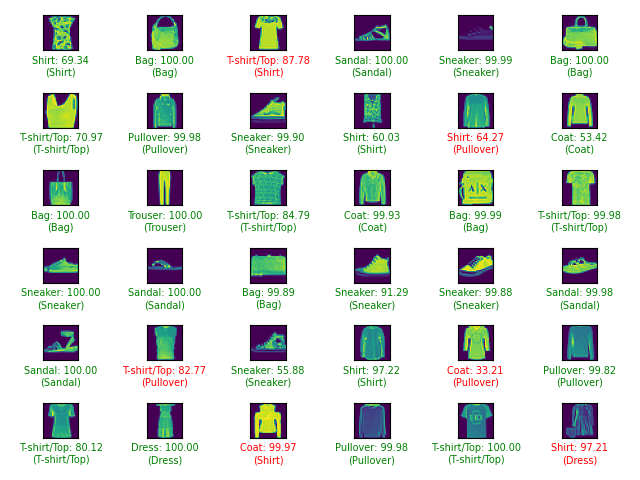

**Introduction**  
  
Given a set of clothing images, we are to match coresponding labels. In this case, the training set consists 
of 60000x28x28 images and 10 categories: T-Shirt, Trouser, Pullover, Dress, Coat, Sandal, Shirt, Sneaker, Bag and 
Ankle boot. To solve this classification problem, we will use a deep learning approach.  
  
**Methods**  
  
**KNN**  
  
Before we move on to the deep learning technique, let's talk about K-nearest neighbor algorithm (KNN). This is a classic 
and very simple classification method. Observation is classified based on other K nearest observations chosen by the distance 
function (hence the name of the algorithm). Because our images are converted to binary format using simple 
thresholding, we will use Hamming distance as our metric. Hamming distance is a number of positions, on which our binary 
vectors differ:  
  
  
  
The K hyperparameter is chosen by hand or by iteration. Here are the results for a few different values:  
  
| **K** | **Accuracy** |  
| --- | --- |  
| 1 | 78,48% |  
| 4 | 78,93% |  
| **9** | **79,38%** |  
| 20 | 78,29% |  
| 50 | 76,64% |  
| 100 | 75,18% |  
  
We will use this data for comparision with our deep learning approach.  
  
**Deep Learning**  
  
Deep learning is a class of algorithms based on multiple sequential layers which progressively extract higher level 
features used to identify our model. The class used in this case is a convolutional neural network (CNN) with a few 
additions and augmentations. First of all, let's look at our data set and how it is processed before being ingested 
into the network.  
  
   
  
All training/testing examples are 28x28 monochromatic images. First, we transform those 2D arrays to 3D one channel 
tensors and normalize all values. The next step is to use ImageDataGenerator to randomly shear, flip, translate and 
zoom all 60000 images and append the results to our old Fashion-MNIST one. This will greatly increase the training 
set. Now comes the actual, deep learning process. This is a visualization of our model:  
  
  
  
First two phases consists of few convolution layers. Convolution is a process of adding each pixel value to 
its neighbors, weighted by the filter (kernel). This allows us to extract various features from the image.  
  
  
  
We then use normalization layer to again bring all values to desired range and apply MaxPooling2D which downsamples 
our result by a factor of two. For every 2x2 section of the data, we take the maximum value. We repeat the same process 
second time, but with twice as many filters. This is a standard CNN procedure, but we can improve it slightly by adding 
one LTSM layer. LTSM stands for Long Short Term Memory and is a recurrent network architecture which means it has a 
feedback loop enabling it to "remember" information. This type of network is commonly used to predict 
sequences of data. Lastly, we flatten all output data to 1D array and pass it through two standard densely-connected 
neuron layers of which last one has size of 10 and represents our categories.  
  
All kernels in convolution layers are initialized with random uniform values and use ReLU activation 
function: f(x) = max(0, x). Last dense layer uses softmax function (input is turned into probabilities that sum to one).  
  
To fight overfitting, situation when function is too tightly fit to the training data, we also apply dropout layers 
in between which turn-off random neurons based on given percentage. Dropout is not needed in the convolution layers 
as Normalization and MaxPooling2D layers are already taking care of this problem.  
  
To fit the model to the training set, instead of regular stochastic gradient descent (SGD), we use Adam. Regular SDG 
computes our gradient iteratively with fixed step towards the maximum. Adam however changes its value based on how 
quickly the gradient is changing and other network parameters. Computing gradient for whole training set is 
computationally expensive and can lead to a very slow descent towards the maximum. Instead we will compute 
gradients for N batches of data which will not only eliminate said problems, but will also make the step of our 
approximation process more stable. 20% percent of the training data will be used as our validation set. Now comes 
the actual model fitting which results and selected hyperparameters will be covered in the next section.  
  
**Results**  
  
All computations where done using Keras, Numpy and Tensorflow libraries for Python. Due to long computations times, 
all models were fitted in epochs of 10.  
  
| **Batch size** | **1st Dropout rate** | **2nd Dropout rate** | **Size of LSTM layer** | **Size of 1st Dense layer** | **Accuracy** |  
| --- | --- | --- | --- | --- | --- |  
| 128 | 0.4 | 0.5 | 256 | 128 | 92.40% |  
| 128 | 0.4 | 0.5 | 128 | 128 | 92.47% |  
| 128 | 0.4 | 0.5 | 128 | 256 | 92.90% |  
| 128 | 0.5 | 0.6 | 128 | 128 | 92.90% |  
| 256 | 0.4 | 0.5 | 128 | 128 | 92.44% |  
| **256** | **0.4** | **0.5** | **256** | **128** | **93.56%** |  
| 256 | 0.5 | 0.6 | 256 | 128 | 92.44% |  
| 128 | 0.4 | 0.5 | 512 | 128 | 92.86% |  
  
Now let's compare our best result with the previous KNN experiment and other deep learning benchmarks 
from fashion-mnist repository:  
  
| **Method/Classifier** | **Preprocessing** | **Accuracy** |  
| --- | --- | --- |  
| **2 Conv+pooling+LSTM+2 dense** | **Normalization, random shear, random flip, random translation, random zoom** | **93.56%** |  
| 2 Conv | None | 92.5% |  
| 2 Conv | Normalization | 92.2% |  
| 2 Conv+pooling+ELU activation | None | 90.3% |  
| 3 Conv+pooling+BN | None | 90.3% |  
| 2 Conv | Normalization, random horizontal flip, random vertical flip, random translation, random rotation. | 91.9% |  
| KNN, K=9 | Binarization | 79.38% |  
  
As we can see, the CNN+LSTM model closely resembles other convolution models and thanks to preprocessing and LSTM layer 
we can achieve better accuracy over the less complex ones. This score could be further improve with even more 
hyperparameters fine-tuning and maybe larger epoch limits.  
  
  
  
**Usage**  
  
- Libraries: PIL, tensorflow, pyplot and numpy.  
- Python version: 3.8 64bit  
- All training data is automatically downloaded.  
- To test the KNN method, run the knn.py file. Because of the way how the Hamming distance is calculated, minimum 
of 16GB of ram is required. Calculated model for this method is not provided.  
- To reproduce the results of CNN+LSTM model with different parameters, run four.py file.  
- The model with the best accuracy is provided as best\_model directory and can be tested with test.py  
  
**Bibliography/Sources**  
  
- Documentations of respective libraries.  
- Various deep learning/ai guides and tutorials.  
- Fashion-MNIST repository.  
- KNN code reused previous assignments.  
- Images from various places from internet and previous assignments documents.